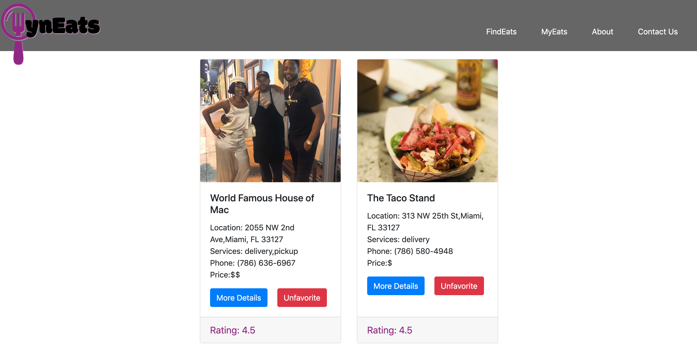

# WynEats

### What
WynEats is an application designed to give the people of Wynwood a quick and engaging way to find places to eat nearby. The app is calling Yelp's API for past reviews and information on a clean and simple UI that allows the user to favorite their most loved restaurants as well as pick a random restuarant when picking is just too hard.

### Status
The project is a work in progress. The backend still needs to be setup.

### Screenshots
Landing Page:

Favorites:

### Why
After weeks of trying to find recommendations to eat around Wynwood at Wyncode Academy, our group saw a need to create a food site for restaurants exclusive to Wynwood. In addition to searching for new restuarants, we wanted to create a feature that enages the user to favorite the restaurants he or she wants to remember or refer others too. The app also has a feature that picks a random restaurant in case the user doesn't want the burder of having to pick!

### Who
Jamile Reid
Joseph Sortino
Sonia St.Remy
Lavonnyka Howell
Dean Lovett

Members of cohort 36 in Wyncode Academy

### How:
Dependencies
WynEats was built using React. Our group used Visual Studio as our code editor.

## Install
We added the neccesary packages by including the following commands:
add react-bootstrap bootstrap
yarn add react-router-dom
yarn add axios
add .env into your folder and add the CLIENT_ID & YELP_API_KEY into the file. You can reach out to a code owner(listed under the Who) for these details

To run the application, Yarn install needs to be run in the premaster branch and inside client. Then Yarn Dev or Yarn Start can be run to view the application on the local host 3000.

### Contribute
If you want to contribute to the github, feel free to post an issue and contact one of the code owners. Once a member of the group reviews the purpose of the issue, we can take steps to work toward outside contribution.

A git clone is neccesary and then the above mentioned dependencies are required. A contributor would need to create a seperate branch off of Premaster and commit up.

### Steps to Contribute

1. An issue can be created on the issues section of the repo's main page. Click "New Issues" and create the issue title and comment a summary of what the issue will resolve. Please assign the issue to yourself and label the issue as an "enhancement."
2. Create a seperate branch off of premaster with the following commands:
3. git checkout -b enhancement-(issuenumber)-(yourname)
4. All of your changes will be saved in this branch. Please remember to command-s to save the changes
5. Once your changes are ready to be merged to master "Premaster" branch, you can use the command: git add .
6. Check git status to see that your addition was added. The addition should appear in git status and be in green if added
7. Use the following command to commit up: git commit -m "short description of your change"
8. Use the following command to push up: git commit -u origin (nameofbranch) or (enhancement-(issuenumber)-(yourname))
9. In the repo, after the commit, an option in the pull requests section will say "Compare & Pull Request". Click that to create the Pull Request
10. For the Pull Request, it can be the name of the branch and the commentary should be "closes #yourissuenumber. For example, if my issue was #2 my PR commentary would be "Closes #2."
11. The label should be "enhancement" and the reviewers should be 2 of the members of the group. Again, please reference the Who section above
12. After two members of the group review the code, someone can merge the pull request into the master "premaster"
